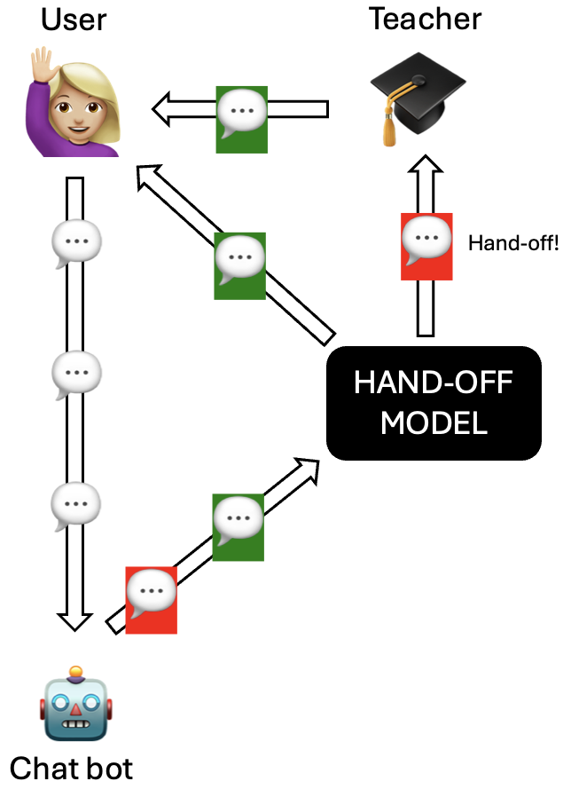

# DAMI Hand-Off Model for LLM-Based Math Coaching
by Kevin Kokalari (kokalari@kth.se), and Andreas Weiss (aweiss@kth.se)

This repository contains a modified version of the **DAMI** (Difficulty-Assisted Matching Inference) hand-off model, adapted to work in an LLM-based math coaching setting.

The goal is to automatically decide **when a human tutor should take over** from an LLM chatbot in a math help conversation. The model is trained and evaluated on AI-generated math dialogues and evaluated with **Golden Transfer within Tolerance (GT-T)** metrics.



This repository contains the implementation used in the following master thesis report:

[Using Hand-off in LLM-Automated Math Coaching](https://www.diva-portal.org/smash/record.jsf?pid=diva2%3A1886733&dswid=-7271)

---

## Background

DAMI is a Machine–Human Chatting Handoff (MHCH) model designed to detect when a chatbot can no longer handle a conversation and a human should step in. It combines:

- difficulty-aware text encoding with BiLSTM + attention  
- matching/repetition analysis between user turns  
- an utterance-level classifier deciding “hand-off” vs “normal” messages

In this project, DAMI is:

- **ported from Chinese to English**, using `nltk` and `textblob` for tokenisation, POS-tagging and sentiment analysis.
- trained on the **PRM800K** phase-2 dataset of AI-generated, expert-rated step-by-step math solutions.
- evaluated for a math-tutoring scenario similar to services like **Mattecoach.se**.

---

## Dataset

The code expects data derived from **PRM800K (phase 2)**:

- Each sample contains:
  - a math problem
  - a sequence of AI-generated solution steps
  - expert labels for each step: `good` (1), `ok` (0), `bad` (-1)

For training the hand-off model, we assume:

- steps labeled **`good` → `Normal`** (no hand-off needed)  
- steps labeled **`ok` or `bad` → `Hand-off`** (a human should take over)

The raw PRM800K data is **not included** in this repository.  
Please obtain it from the original authors and point the preprocessing script to your local copy.


---

## Method

High-level pipeline:

1. **Preprocessing**
   - Load PRM800K phase-2 conversations.
   - For each math problem, sample one AI-generated continuation per step (when multiple are available).
   - Convert expert ratings into “Normal” vs “Hand-off” labels.
   - Build sequences of utterances for DAMI, keeping conversation order.

2. **Text processing (English)**
   - Tokenisation and part-of-speech tagging using **NLTK**.
   - Sentiment / polarity features using **TextBlob**.
   - Difficulty-assisted encoding with BiLSTM + attention, combining:
     - word embeddings
     - positional embeddings
     - POS-tag embeddings, plus sentiment features

3. **Hand-off classification**
   - Matching Inference module detects repeated / semantically similar user messages.
   - Utterance Labeling module predicts a probability of “Hand-off” for each message. 
   - A threshold (e.g. 0.5) is used to decide the final label.

4. **Evaluation**
   - Compute **GT-T** metrics:
     - GT-1, GT-2, GT-3 (different tolerances for how close the predicted hand-off is to the true point).  
   - Also inspect confusion matrices for “Normal” vs “Hand-off” on the test set. 

---

## Results

On the held-out test split, the adapted DAMI model achieves:

- **Training loss:** 0.1612  
- **Validation loss:** 0.2568  
- **Test loss:** 0.2446  
- **GT-1:** 91.71 %  
- **GT-2:** 94.53 %  
- **GT-3:** 95.42 %  

The confusion matrix on the test set shows that the model:

- correctly detects **1 908** hand-off situations,  
- correctly keeps **4 692** normal messages,  
- never misclassifies a true hand-off as normal (no false negatives),  
- but sometimes triggers an early / unnecessary hand-off (673 false positives), making the model *pessimistic* but safe.  


---

## Getting started

### 1. Install dependencies

Create a virtual environment and install:

```bash
conda create -n handoff python=3.7
conda activate handoff
pip install -r requirements.txt
```

### 2. Prepare data (if you start from raw conversations):

Run:
```bash
python data_prepare.py
```
or use the prepared data by extracting `vocab.zip` into the `data/vocab` folder.

### 3. Modify and set DAMI's hyperparameters

Edit the hyperparameters stored under 'config/model' and 'config/data' for your scenario (e.g., sequence length, batch size, learning rate, dataset name).

### 4. Train and evaluate DAMI:

Training:
```bash
python main.py --phase train --data_name vocab --model_name dami --gpu 0 --memory 0.80
```
Prediction / Evaluation:
```bash
python main.py --phase predict --data_name vocab --model_name dami  --model_path "path/to/checkpoint" --gpu 0 --memory 0.80
```
`--model_path` should point to the checkpoint produced during training.


---

## Repository structure

- `config/`
  - `data/config.vocab.json` – data/preprocessing configuration
  - `model/config.dami.json` – DAMI model and training configuration
- `data/vocab/`
  - `train.json` / `train.pkl` – training set
  - `test.json` / `test.pkl` – test set
  - `eval.json` / `eval.pkl` – evaluation set
  - `vocab.json` / `vocab.pkl` – vocabulary and token mappings
- `data/`
  - `parsePickleToTxt.py` – helper script to inspect pickled datasets
  - `attention.py` - the attention function of the DAMI model
  - `transformer.py` - the transformer implementation for the DAMI model
- `networks/layers/DAMI.py` – core DAMI model layers
- `networks/Network.py` – network wrapper / training logic
- `data_prepare.py` – preprocessing pipeline to build the `*.json` / `*.pkl` files
- `data_loader.py` – dataset loading utilities
- `main.py` – main entry point for training and evaluation
- `utility.py`, `vocab.py` – helper functions and vocabulary tools
- `requirements.txt` – Python dependencies
- `README.md` – this file

---


## Acknowledgements

This codebase is a fork and adaptation of the original **DAMI** implementation for
Machine–Human Chatting Handoff by Liu et al.:

> Jiawei Liu, Zhe Gao, Yangyang Kang, Zhuoren Jiang, Guoxiu He,  
> Changlong Sun, Xiaozhong Liu, Wei Lu.  
> *Time to Transfer: Predicting and Evaluating Machine-Human Chatting Handoff.*  
> AAAI Conference on Artificial Intelligence, 2021.

Original repository: <https://github.com/WeijiaLau/MHCH-DAMI>

In this fork, we adapt DAMI to an English, math-coaching setting, add a preprocessing pipeline for PRM800K-style math dialogues, and evaluate the model with GT-T metrics for deciding when a human tutor should take over from an LLM.
